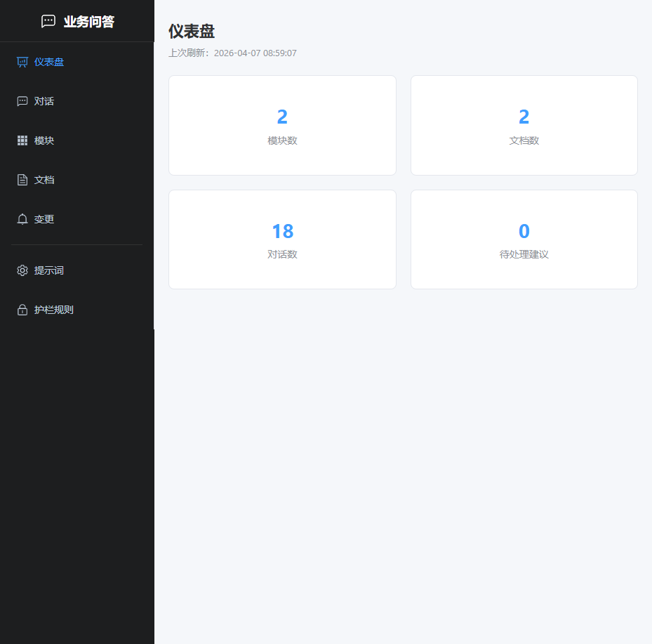
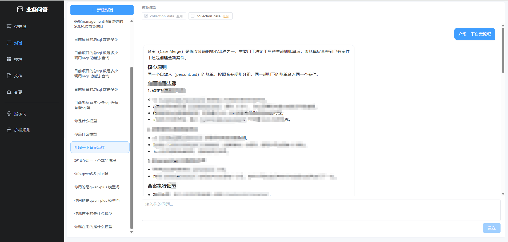
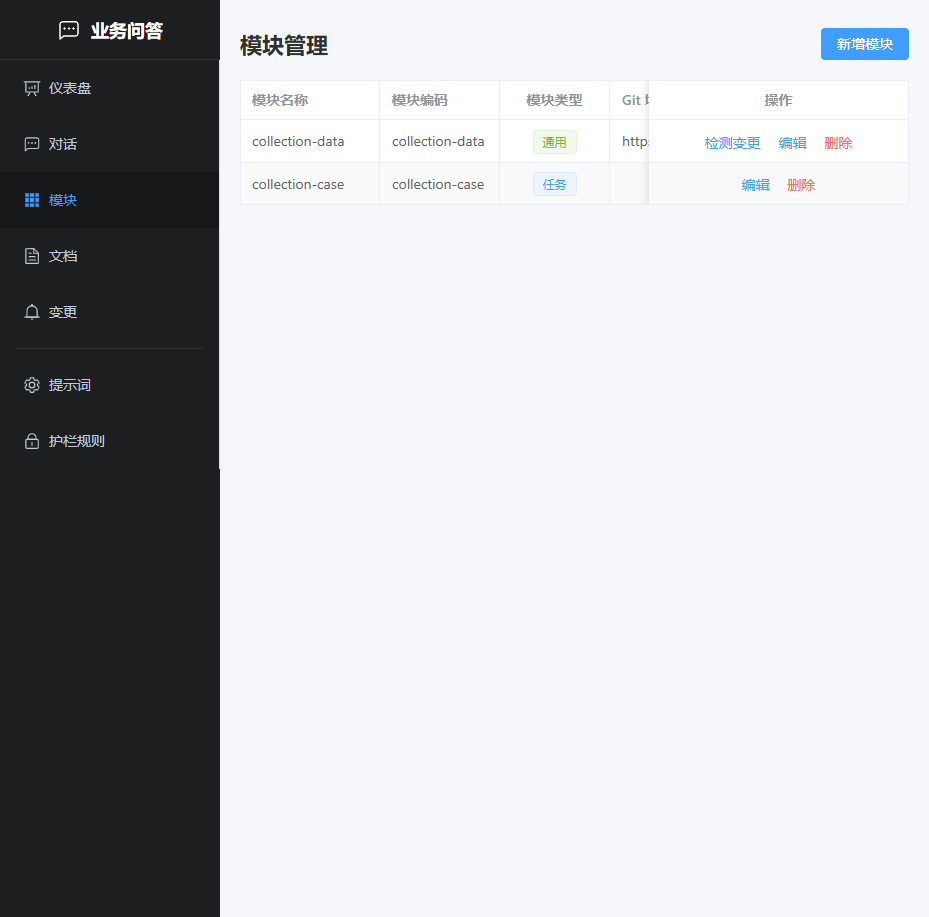
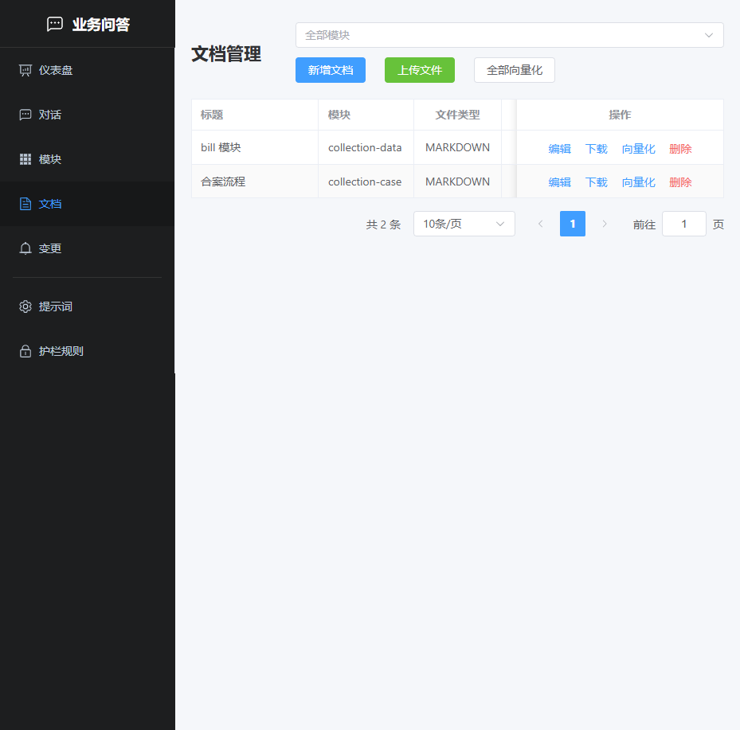
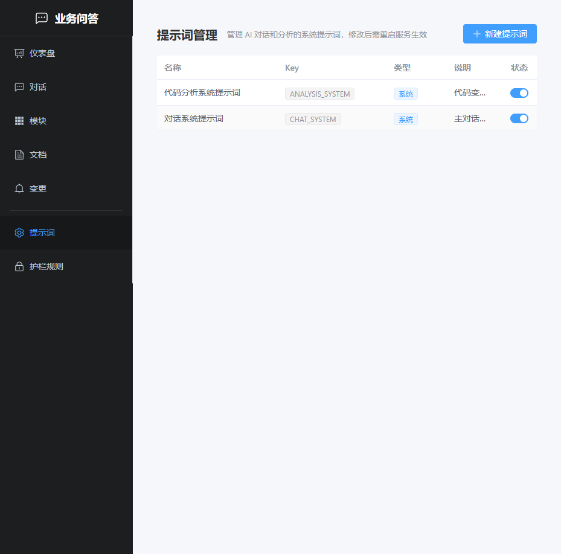
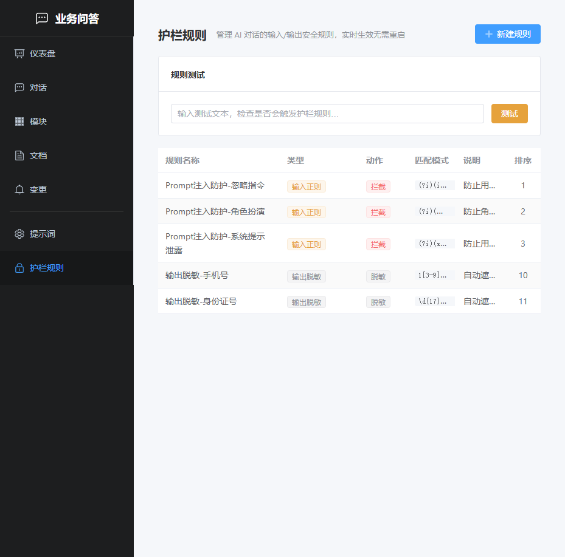

# Business QA — 业务智能问答助手

基于 RAG（检索增强生成）的业务系统智能问答助手。上传业务文档后，AI 可基于文档内容回答自然语言问题，并在代码变更时自动给出文档修改建议。

## 功能概览

- **智能问答（RAG）**：自然语言提问，AI 基于文档内容生成回答，附带引用来源
- **混合检索**：向量语义检索 + PG BM25 全文关键词检索，RRF 融合排序
- **查询改写**：LLM 自动将口语化查询改写为精确检索语句，提升检索精度
- **对话摘要**：超长对话自动压缩为摘要，保留完整上下文又控制 token 消耗
- **引用溯源**：回答中标注来源文档，可展开查看引用详情
- **文档管理**：支持在线编辑和文件上传（PDF/Word/TXT/Markdown），递归分块 + 重叠窗口向量化
- **模块组织**：按业务模块归类文档，COMMON 模块问答时自动包含，TASK 模块按需勾选
- **Prompt 管理**：系统提示词在线编辑，支持热更新
- **AI 护栏**：输入护栏（Prompt 注入防护、敏感词拦截）+ 输出护栏（手机号/身份证自动脱敏）
- **弹性保护**：LLM 调用智能重试 + Resilience4j 限流/熔断
- **变更检测**：Git 代码变更检测 + AI 生成文档修改建议
- **MCP 集成**：通过 MCP 协议连接 sentinel-ai，获取 SQL 分析能力
- **流式对话**：SSE 实时流式输出，Markdown 渲染 + 代码高亮
- **文件存储**：MinIO（S3 兼容）存储上传文件，Apache Tika 解析文档内容

## 界面预览

### 仪表盘

模块数、文档数、对话数、待处理建议数一览。



### 智能对话

支持多轮对话、流式输出、模块筛选，回答带引用来源和文档出处折叠面板。



### 模块管理

按业务维度组织文档，支持 COMMON（通用）和 TASK（任务）两种类型，可关联 Git 仓库做变更检测。



### 文档管理

支持在线编辑（Markdown）和文件上传（PDF/Word/TXT），上传后自动解析、分块、向量化。



### 提示词管理

系统提示词存储在数据库中，可在线编辑、启停，无需改代码重新部署。



### 护栏规则

输入侧 Prompt 注入防护 + 敏感词拦截，输出侧手机号/身份证自动脱敏。规则实时生效，带在线测试功能。



## 功能完成状态

| 功能 | 状态 | 说明 |
|------|------|------|
| 模块管理（CRUD） | ✅ 已完成 | 支持 COMMON/TASK 类型，关联 Git 仓库 |
| 文档管理（在线编辑 + 文件上传） | ✅ 已完成 | 支持 PDF/Word/TXT/Markdown，MinIO 存储 |
| 递归分块 + 重叠窗口向量化 | ✅ 已完成 | 4 级语义边界递归分割，相邻块 150 字符重叠 |
| 混合检索（向量 + BM25 + RRF） | ✅ 已完成 | 双路检索 + Reciprocal Rank Fusion 融合 |
| 查询改写（RewriteQueryTransformer） | ✅ 已完成 | LLM 自动改写口语化查询 |
| 对话摘要压缩 | ✅ 已完成 | 超阈值时 LLM 压缩旧消息为摘要 |
| 引用溯源 | ✅ 已完成 | LLM 内联标注 + sourceRefs 面板 + citation-tag 渲染 |
| RAG 智能问答 | ✅ 已完成 | 模块过滤检索 + SSE 流式 + 多轮对话记忆 |
| Prompt 模板管理 | ✅ 已完成 | 系统/用户提示词在线编辑、启停、CRUD |
| AI 护栏（Guardrails） | ✅ 已完成 | 输入拦截 + 输出脱敏，规则在线管理 + 实时测试 |
| LLM 智能重试 | ✅ 已完成 | Advisor 层指数退避重试，支持同步和流式 |
| 限流与熔断（Resilience4j） | ✅ 已完成 | RateLimiter + CircuitBreaker |
| MCP 工具集成 | ✅ 已完成 | 连接 sentinel-ai 获取 SQL 分析工具 |
| 仪表盘 | ✅ 已完成 | 模块数/文档数/会话数/待处理建议数 |
| Git 变更检测 | ✅ 已完成 | JGit 拉取 + diff 检测 + AI 分析建议 |
| 变更建议管理 | ⚠️ 部分完成 | 可查看/忽略建议，"应用建议"仅更新状态 |

### 下一阶段规划

| 功能 | 优先级 | 说明 |
|------|--------|------|
| 应用建议自动修改文档 | 高 | 点击"应用"后将 AI 建议写入文档，触发重新向量化 |
| 文档版本历史 | 高 | 记录修改快照，支持回滚 |
| 中文分词增强 | 中 | 安装 PG zhparser 扩展，提升 BM25 中文检索效果 |
| 检索效果可视化 | 中 | 调试模式展示命中分块、相似度分数 |
| Markdown 编辑器 | 中 | 替换为富文本 Markdown 编辑器 |
| 仪表盘增强 | 中 | 按模块统计、趋势图、问答热度排行 |
| 用户认证 | 低 | 接入登录认证，支持多用户隔离 |

## 技术栈

| 层面 | 技术 |
|------|------|
| 后端 | Java 21, Spring Boot 3.5.x, Spring AI 1.1.4, Resilience4j 2.2.0 |
| AI 模型 | DashScope（百炼）qwen3.5-plus，OpenAI 兼容接口 |
| Embedding | DashScope text-embedding-v3（1024 维） |
| 向量库 | PostgreSQL + pgvector（HNSW 索引，余弦距离） |
| RAG | RetrievalAugmentationAdvisor + HybridDocumentRetriever + RewriteQueryTransformer |
| ORM | MyBatis-Plus 3.5.7 |
| MCP | Spring AI MCP Client（Streamable HTTP） |
| 文件存储 | MinIO（S3 兼容）+ Apache Tika 文档解析 |
| Git 操作 | JGit 7.1.0 |
| 前端 | Vue 3, TypeScript, Element Plus, Vite 6 |

## 架构概览

```
用户提问
  → RateLimiter 限流
  → 输入护栏（Prompt 注入防护、敏感词拦截）
  → 引用预检索（sourceRefs）
  → ChatClient.stream()
    → LlmRetryAdvisor（指数退避重试）
    → RetrievalAugmentationAdvisor:
      → RewriteQueryTransformer（查询改写）
      → HybridDocumentRetriever（向量 + BM25 + RRF）
      → ContextualQueryAugmenter（上下文注入）
    → MessageChatMemoryAdvisor（SummarizingChatMemory 摘要压缩）
    → LLM API 调用（+ MCP 工具按需挂载）
  → CircuitBreaker 熔断保护
  → 输出护栏（敏感信息脱敏）
  → [REFS:json] + 流式内容 → 前端
```

## 快速开始

### 环境要求

- Java 21+
- Node.js 18+
- PostgreSQL 16+（需安装 pgvector 扩展）
- Maven 3.9+
- MinIO（可选，用于文件上传存储）

### 数据库初始化

```bash
createdb business_qa
psql business_qa -c "CREATE EXTENSION IF NOT EXISTS vector;"
psql business_qa -f business-qa-server/src/main/resources/db/schema.sql
```

### 后端启动

```bash
# 复制配置文件并填入实际值
cp business-qa-server/src/main/resources/application-dev.yml.example \
   business-qa-server/src/main/resources/application-dev.yml
# 编辑 application-dev.yml，填入数据库密码、API Key 等

# 构建并运行
mvn clean package -DskipTests
java -jar business-qa-server/target/business-qa-server-1.0.0-SNAPSHOT.jar
```

后端服务地址：http://localhost:8091

### 前端启动

```bash
cd business-qa-ui
npm install
npm run dev
```

开发服务地址：http://localhost:5174

### MinIO 启动（可选）

```powershell
# Windows PowerShell
.\scripts\start-minio.ps1

# 或 CMD
scripts\start-minio.bat
```

MinIO 控制台：http://localhost:9001

## 项目结构

```
business-qa/
├── pom.xml                          # 父 POM
├── scripts/                         # MinIO 启动脚本
├── business-qa-server/              # Spring Boot 后端
│   ├── pom.xml
│   └── src/main/java/com/zhuangjie/qa/
│       ├── config/                  # Spring 配置（AiChatConfig, ResilienceConfig 等）
│       ├── controller/              # REST 接口
│       ├── chat/                    # 对话引擎（ChatService + ChatHistoryService）
│       ├── doc/                     # 文档管理 + 递归分块（ChunkSplitter）
│       ├── file/                    # 文件基础设施（S3 存储、Tika 解析）
│       ├── change/                  # Git 变更检测 + AI 建议
│       ├── guardrail/               # AI 护栏（输入检查 + 输出脱敏）
│       ├── rag/                     # RAG 基础设施（HybridDocumentRetriever, SummarizingChatMemory）
│       └── db/                      # 实体、Mapper、DbService
├── business-qa-ui/                  # Vue 3 前端
│   └── src/
│       ├── views/                   # 页面（Chat, Prompts, Guardrails 等）
│       ├── components/              # 组件（ChatMessage 含引用渲染）
│       └── api/                     # API 层
└── .cursor/rules/                   # Cursor AI 规则
```

## 配置说明

需要配置的环境变量 / 配置项：

| 变量 | 说明 |
|------|------|
| `POSTGRES_PASSWORD` | PostgreSQL 密码 |
| `AI_DASHSCOPE_API_KEY` | DashScope（百炼）API Key |
| `GIT_USERNAME` | Git 仓库认证用户名 |
| `GIT_PASSWORD` | Git 仓库密码/Token |
| `QA_STORAGE_ENDPOINT` | MinIO 地址（默认 http://localhost:9000） |
| `QA_STORAGE_ACCESS_KEY` | MinIO 访问密钥（默认 minioadmin） |
| `QA_STORAGE_SECRET_KEY` | MinIO 密钥（默认 minioadmin） |

RAG 相关配置（`qa.rag.*`）：

| 配置项 | 默认值 | 说明 |
|--------|--------|------|
| `chunk-size` | 800 | 最大分块字符数 |
| `chunk-overlap` | 150 | 相邻块重叠字符数 |
| `top-k` | 5 | 检索返回文档数 |
| `similarity-threshold` | 0.45 | 向量相似度阈值 |
| `rrf-k` | 60 | RRF 融合常数 |
| `memory-max-messages` | 16 | 对话记忆保留近期消息数 |
| `memory-summarize-threshold` | 24 | 触发摘要的消息数阈值 |

> 敏感配置写在 `application-dev.yml` 中（已被 .gitignore 排除），参考 `application-dev.yml.example`。

## MCP 集成

business-qa 作为 MCP Client，通过 Streamable HTTP 协议连接 sentinel-ai MCP Server，获取 SQL 分析工具。LLM 在对话中可根据用户问题自动决定是否调用这些工具。

```
business-qa (MCP Client) ←Streamable HTTP→ sentinel-ai (MCP Server, :8090/mcp)
```

## License

MIT
